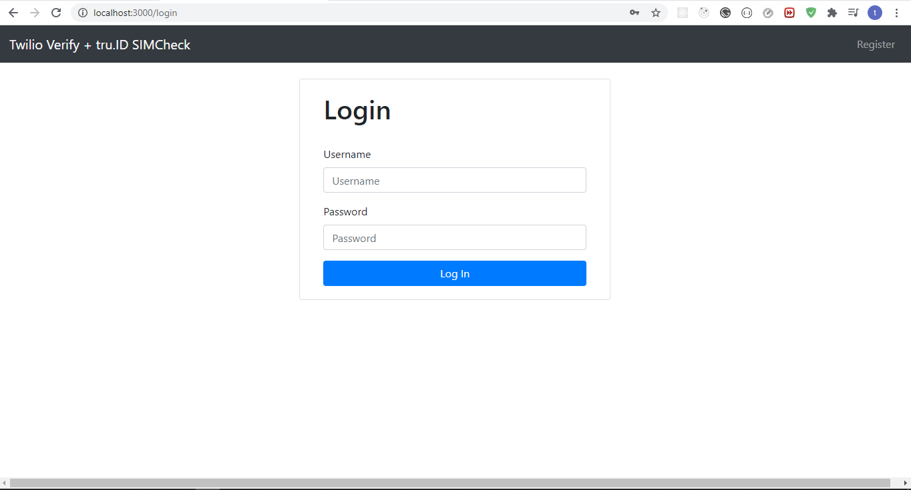
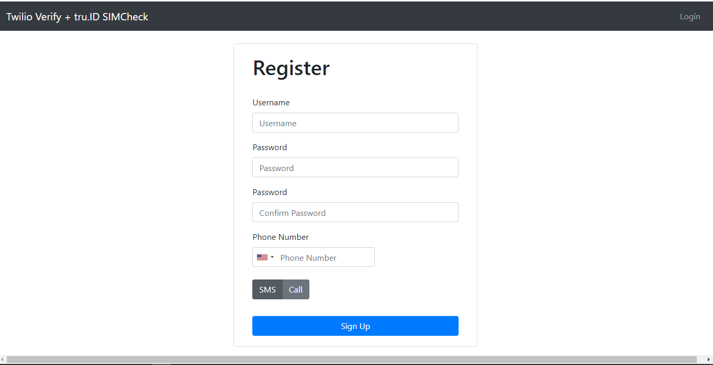
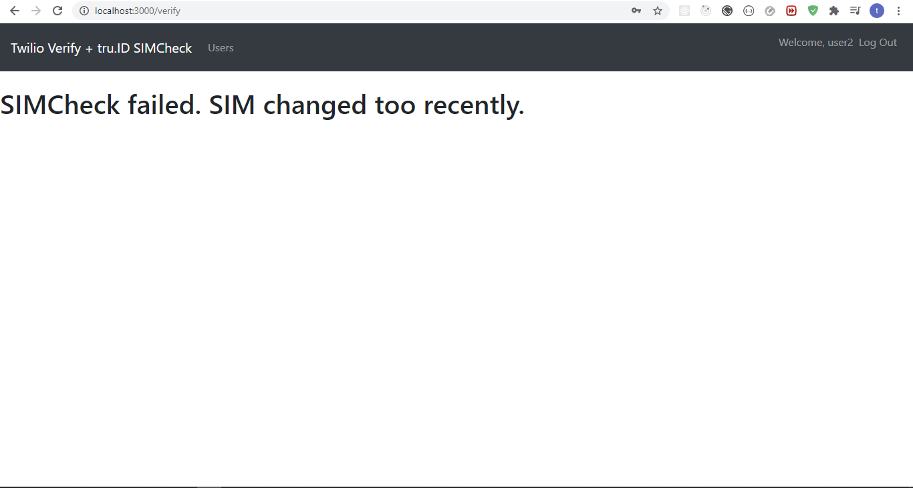

# Adding SIM Swap Detection to your Web App's 2FA Login Flow with Twilio Verify & tru.ID SIMCheck API

In today's tutorial you're going to learn how to add SIM Swap Detection to your existing Web App's Two-Factor authentication login flow with **tru.ID's** [SIMCheck API](https://developer.tru.id/docs/sim-check/guide).

We're going to be using Twilio's [verify-v2-quick-start-node](https://github.com/TwilioDevEd/verify-v2-quickstart-node) as the existing 2FA base.

Before we begin let's talk about why you would want to secure your applications with the **tru.ID** SIMCheck API.

The **tru.ID** SIMCheck API provides information on when a SIM card associated with a mobile phone number was last changed. This provides an extra layer of security in your application login flows as it guards against the possibility the user's SIM was swapped (hence why the SIM changed recently). It can be used to augment existing 2FA or anti-fraud workflows.

## Before you begin

Before you begin there are a few requirements for this project which are:

- Node 10 or higher
- A [Twilio Account](https://www.twilio.com)
- A [tru.ID Account](https://tru.id)
- [SQLite3](https://www.sqlite.org/download.html)

## Getting Started

This project uses Twilio's [verify-v2-quick-start-node](https://github.com/TwilioDevEd/verify-v2-quickstart-node) as the base in the `starter-files` branch.

Clone the `starter-files` branch via:

```
git clone -b starter-files --single-branch https://github.com/tru-ID/sms-2fa-sim-swap-detection.git
```

If you're only interested in the finished code in `main` then head over to the GitHub [repo](https://github.com/tru-ID/sms-2fa-sim-swap-detection)

### Getting setup with Twilio

You need to configure Twilio using your account credentials.

Copy the values of `.env.example` into a `.env` file via:

```
cp .env.example .env
```

Open the `.env` file and configure the following values:

- `TWILIO_ACCOUNT_SID`: Your Twilio account SID found [here](https://www.twilio.com/console)
- `TWILIO_AUTH_TOKEN`: Your Twilio Auth Token that can be found [here](https://www.twilio.com/console/)
- `VERIFICATION_SID`: This project uses Twilio Verify to send verification codes and to check their status - [create a service here](https://www.twilio.com/console/verify/services)

### Getting setup with tru-ID

Create a [tru.ID Account](https://tru.id)

Install the **tru.ID** CLI via:

```bash
npm i -g @tru_id/cli

```

Input your **tru.ID** credentials which can be found within the **tru.ID** [console](https://developer.tru.id/console)

Create a new **tru.ID** project via:

```
tru projects:create sms-2fa
```

configure the following values in your `.env`:

- `TRU_ID_CLIENT`: The client ID found in the `tru.json` file in the newly created **tru.ID** project.
- `TRU_ID_SECRET`: The client secret found in the `tru.json` file in the newly created **tru.ID** project.

## Starting the project

First, startup SQLite3.

Next in the project directory, restore dependencies via:

```
npm install
```

This will also run Database migrations creating the `users` table.

Finally, to start the project run:

```bash
npm run nixstart #for running on Linux machines e.g. Mac
# or
npm run winstart #for running on Windows machines
```

The project should look like this on startup:



The register page should look like this:



## Existing App Workflow

The existing app workflow is as follows:

1. Navigate to `/` , redirect to `/login` if not logged in.
2. Login an existing user or register a new user.
3. On successful registration or login, redirect to `/verify` for SMS OTP verification with Twilio's Verify API to take place.
4. If OTP could not be sent or OTP does not match render error to user. If OTP matches, assign a role to the user so as to access guarded `/` route and redirect to `/`.

## Augmenting Existing Workflow

We're going to introduce SIM Swap detection to the existing workflow by doing a SIMCheck right before an OTP is generated and depending on the result we proceed with generating the OTP or truncate the login process. That's it!

The workflow now looks like this:

1. Navigate to `/` , redirect to `/login` if not logged in.
2. Login an existing user or register a new user.
3. On successful registration or login, redirect to `/verify` for SMS OTP verification with Twilio's Verify API to take place.
4. Perform SIMCheck before OTP generation. Truncate login process if SIMCheck fails else continue with OTP generation.
5. If OTP could not be sent or OTP does not match render error to user. If OTP matches, assign a role to the user so as to access guarded `/` route and redirect to `/`.

## Performing the SIMCheck

In order to perform the SIMCheck we need to do two things:

- Create a **tru.ID** access token.
- Create a SIMCheck using the newly generated access token.

In order to do any of the two listed above we need to bring in a few packages. Open a new terminal and run:

```
npm install --save btoa node-fetch
```

`btoa` transforms data to base-64 encoded format and `node-fetch` allows us make HTTP network requests in our Node applications.

### Creating the Access Token

In order to create the access token create a new folder called `helpers` , create a file named `createAccessToken.js` and paste in the following code:

```javascript
const btoa = require("btoa");
const fetch = require("node-fetch");
require("dotenv").config();
exports.createAccessToken = async () => {
  /* make request body acceptable by application/x-www-form-urlencoded*/
  const clientID = process.env.TRU_ID_CLIENT;
  const clientSecret = process.env.TRU_ID_SECRET;

  const basicAuth = btoa(`${clientID}:${clientSecret}`);
  const resp = await fetch(`https://eu.api.tru.id/oauth2/v1/token`, {
    method: "POST",
    body: "grant_type=client_credentials&scope=sim_check",
    headers: {
      "Content-Type": "application/x-www-form-urlencoded",
      Authorization: `Basic ${basicAuth}`,
    },
  });
  const { access_token } = await resp.json();
  return access_token;
};
```

The API endpoint requires an `authorization` header. The header identifies basic auth is being used. The value is your tru.ID project client_id and client_secret, found in the tru.json file, concatenated with a colon (:) and Base64 encoded.

So the first step is to ensure the header matches.

Next we make an API `POST` request with form URL encoded.

Lastly in the body we set `grant_type` to `client_credentials` and `scope` to `sim_check`.

The `scope` instructs the tru.ID OAuth provider that the created Access Token should have permissions to use SIMCheck resources as indicated by `sim_check`.

### Creating the SIMCheck

In the `helpers` folder create a file named `performSimCheck.js` and paste the following code:

```javascript
const fetch = require("node-fetch");
exports.performSimCheck = async (phone_number, access_token) => {
  const body = JSON.stringify({ phone_number });
  const response = await fetch(`https://eu.api.tru.id/sim_check/v0.1/checks`, {
    method: "POST",
    body,
    headers: {
      Authorization: `Bearer ${access_token}`,
      "Content-Type": "application/json",
    },
  });
  const data = await response.json();
  console.log(data);
  return data.no_sim_change;
};
```

Here we make accept a phone number in E.164 format, the access token from the previous step and create the SIMCheck. The SIMCheck can either fail with a `400` because we don't support the number or be successful returning information on whether the SIM has changed or not.

A sample successful response is:

```
{
  _links: {
    self: {
      href: 'https://eu.api.tru.id/sim_check/v0.1/c6-bbae-50358ae3bb08'
    }
  },
  check_id: '2563f2a6-0b9e-49c6-bbae-50358ae3bb08',
  status: 'COMPLETED',
  no_sim_change: true,
  charge_amount: 1,
  charge_currency: 'API',
  created_at: '2021-03-17T14:49:29+0000',
  snapshot_balance: 13
}
```

A sample failure response is:

```
{
type: 'https://tru.id/docs/api-errors#mno_not_supported',
  title: 'Bad Request',
  status: 400,
  detail: '400 Bad Request Mobile Network Operator
Not Supported'
}
```

## Integrating our helper functions

Finally, we need to integrate our changes to augment the workflow. Head over to `routes/verify.js` and in the `try` of `router.get('/', ensureLoggedIn(),async (req,res)=> {})` paste the following code:

```javascript
const { createAccessToken } = require("../helpers/createAccessToken");
const { performSimCheck } = require("../helpers/performSimCheck");
router.get("/", ensureLoggedIn(), async (req, res) => {
  if (req.user.role !== "access secret content") {
  ...

    try {
      //create tru.ID access token
      const accessToken = await createAccessToken();
      console.log(accessToken);
      // perform SIMCheck
      const no_sim_change = await performSimCheck(req.user.phoneNumber.split("+")[1], accessToken);
      console.log(no_sim_change);
      // If the SIM has changed we inform the client
      if (!no_sim_change) {

      }
      verificationRequest = await twilio.verify
        .services(VERIFICATION_SID)
        .verifications.create({ to: req.user.phoneNumber, channel });
    }
    ...
  }

 ...
});
```

The final code should be:

```javascript
const { createAccessToken } = require("../helpers/createAccessToken");
const { performSimCheck } = require("../helpers/performSimCheck");
router.get("/", ensureLoggedIn(), async (req, res) => {
  if (req.user.role !== "access secret content") {
    const errors = { wasValidated: false };
    const channel = req.user.verificationMethod;
    let verificationRequest;

    try {
      //create tru.ID access token
      const accessToken = await createAccessToken();
      console.log(accessToken);
      // perform SIMCheck
      const no_sim_change = await performSimCheck(req.user.phoneNumber.split("+")[1], accessToken);
      console.log(no_sim_change);
      // If the SIM has changed we inform the client
      if (!no_sim_change) {
      }
      verificationRequest = await twilio.verify
        .services(VERIFICATION_SID)
        .verifications.create({ to: req.user.phoneNumber, channel });
    } catch (e) {
      logger.error(e);
      return res.status(500).send(e);
    }

    logger.debug(verificationRequest);

    return res.render("verify", { title: "Verify", user: req.user, errors });
  }

  throw new Error("User already has `access secret content` role.");
});
```

Right before we generate the OTP we create the access token and perform the SIMCheck and if the SIM has changed or the request errors out we handle it within the `if(!no_sim_change)` block.

## Handling SIMCheck Response

Next, we need to create the UI we'll show if the SIMCheck can't be performed because we don't support the mobile carrier or if the SIMCheck response informs us that the SIM changed. Ideally, if any of those two conditions were met you'd be better off sending an email to the user to confirm their identity but for simplicity sake we'll render a UI.

Head over to `views` and create a file named `sim-changed.pug` and paste the following code:

```
extends layout

block content
  .text-center
  h1 #{error}


```

`#{error}` is dynamic meaning we pass it in when we render this view.

The UI looks like this:



We then render it to the screen inside the `if` block:

```javascript
const { createAccessToken } = require("../helpers/createAccessToken");
const { performSimCheck } = require("../helpers/performSimCheck");
router.get("/", ensureLoggedIn(), async (req, res) => {
  if (req.user.role !== "access secret content") {
  ...

    try {
      //create tru.ID access token
      ...

      // perform SIMCheck
  ...
      // If the SIM has changed we inform the client
      if (!no_sim_change) {
        return res.render("sim-changed", { error: "Cannot proceed. SIM changed too recently ❌" });
      }
      verificationRequest = await twilio.verify
        .services(VERIFICATION_SID)
        .verifications.create({ to: req.user.phoneNumber, channel });
    }
    ...
  }

 ...
});
```

## Wrapping up

That's it! That's how simple it is to add SIM Swap detection to your existing 2FA application with **tru.ID's** SIMCheck API.

If you would like to seed the project with a user instead of having to register:

Navigate to `seeders/createUser.js` and replace the `phoneNumber` value with your own `phoneNumber`

Next seed the database by running:

```
npm run seed
```

You can view the diff between the base repo (Twilio's) and the finished app [here](https://github.com/TwilioDevEd/verify-v2-quickstart-node/compare/next...tru-ID:main)

## Resources

- [tru.ID SIMCheck Integration guide](https://developer.tru.id/docs/sim-check/guide)
- [Twilio's verify-v2-quick-start-node](https://github.com/TwilioDevEd/verify-v2-quickstart-node)
